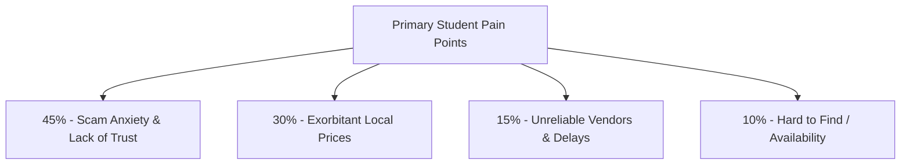
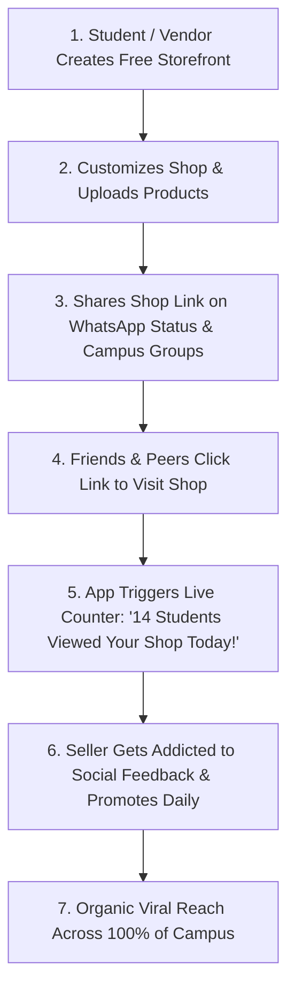
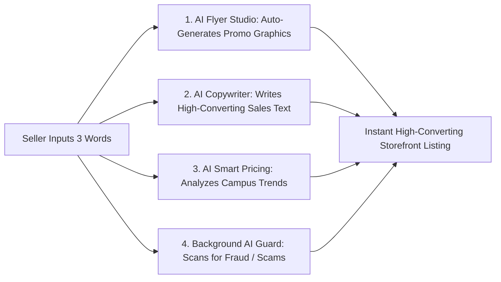
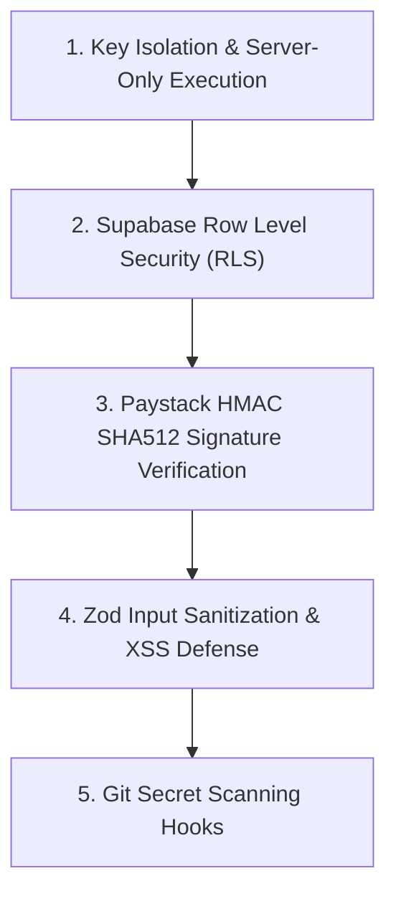
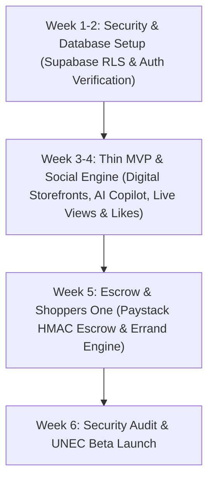

# ENUGU BUY & SELL — MASTER PROJECT DOSSIER
**Official Product Requirement Document (PRD), Architecture Blueprint & Strategy Guide**

*Prepared for Internal Team, Technical Partners, Investors, and Stakeholders*  
*Target Launch Timeline: 6-Week Phased Rollout*  
*Version: 2.1 (Fixed Diagrams)*

---

## 1. Executive Summary & Product Vision

**Enugu Buy & Sell** is an AI-powered, social-first **Student Super App & Business Engine** designed specifically for university campuses, launching first at the **University of Nigeria, Enugu Campus (UNEC)**.

---

## 2. Empirical Survey Findings & Market Validation

Our strategy is grounded in real data collected directly from **20 UNEC students**:

### Key Quotes & Direct Insights from UNEC Students:
*   **On Trust & Scams:** *"I wish there was a business platform where students could buy and sell safely without being cheated."*
*   **On Security & Verification:** *"I wish there were a reliable platform where buyers and sellers could verify each other, make secure payments, and avoid scams."*
*   **On Vendor Reliability:** *"I wish vendors didn't delay... and improved their attitude."*
*   **On Price Inflation:** *"Prices of goods are quite exorbitant compared to other states... I wish I could purchase goods at a cheaper rate."*

---

## 3. The 4 Core Strategic Growth Pillars

### Pillar 1: Zero-Budget Viral Engine (The 2004 Harvard Model)
*   **The Concept:** In 2004, Facebook reached 1/3 of Harvard in 30 days without spending $1 on advertising. 
*   **Our Execution:** Students and campus vendors get customizable **Digital Storefronts**. When a student lists clothes, Avon products, or tech repairs, they proudly share their unique shop link across their WhatsApp status updates, bringing hundreds of new students to the app daily for free.

### Pillar 2: High-Frequency Daily Purchases ("Eat & Live")
*   **The Problem:** Students don't buy laptops or phones every week. A pure tech marketplace gets forgotten.
*   **Our Execution:** Partner with campus food vendors, shawarma stands (Crunches, OpenSharaton), and local supermarkets. Students order daily meals and groceries through the app, ensuring **Daily Active Use (DAU)**.

### Pillar 3: "Shoppers One" — Personal Shopping Ecosystem
*   **The Concept:** Connecting busy university lecturers, workers, and wealthy locals who lack time for market runs with student runners looking to earn money.
*   **Our Execution:** Students register as **"Shoppers One"**. They receive digital shopping lists, purchase items at local markets/supermarkets, and deliver them to buyers for an automated service fee.

### Pillar 4: Addictive Social Validation Loop (The Core MVP Hook)
*   **The Problem:** If sellers list an item and hear crickets, they abandon the app.
*   **Our Execution:** Every storefront and product listing features **Live View Counters** (*"14 students viewing now"*), **Likes**, and **Love Reactions**. Instant social recognition triggers a dopamine loop that retains sellers.

---

## 4. Embedded AI Intelligence Layer (The Seller AI Copilot)

Powered by **Google Gemini API**, every vendor gets a built-in AI assistant to eliminate wasted time:

---

## 5. Competitive Matrix & Strategic Positioning

| Feature / Platform | **Shopify / Bumpa** | **Jiji / Olx** | **Existing Campus Apps** | **Enugu Buy & Sell (Our App)** |
| :--- | :--- | :--- | :--- | :--- |
| **Business Model** | Isolated storefront link | Generic classifieds | Basic campus directory | **Viral Social Super-App & Earning Hub** |
| **Embedded AI Copilot** | ❌ None | ❌ None | ❌ None | **✅ AI Flyer Studio + AI Copywriter** |
| **Social Dopamine Engine** | ❌ None | ❌ None | ❌ None | **✅ Live View Counters, Likes & Reactions** |
| **Personal Shopper Network**| ❌ None | ❌ None | ❌ Basic food delivery | **✅ "Shoppers One" Errand & Market Runners** |
| **Traffic Source** | Merchant pays for ads | Search engine | Manual flyers | **✅ Organic Viral Shares (Zero Ad Spend)** |
| **Trust Architecture** | Basic domain check | ❌ Very Low | Basic student ID | **✅ Student ID Check + Escrow + AI Guard** |

---

## 6. 5-Layer Military-Grade Security Architecture

---

## 7. Multi-Agent Team Task Assignment & 6-Week Roadmap

### 6-Week Execution Timeline:

---

## 8. Financial & Infrastructure Cost Structure

| Component | Provider | Cost at Launch | Cost at Scale (1,000+ Active Users) |
| :--- | :--- | :--- | :--- |
| **Hosting** | Vercel | **$0 / month** (Free tier) | $20 / month |
| **Database & Realtime** | Supabase | **$0 / month** (Free tier) | $25 / month |
| **AI Processing** | Google Gemini API | **$0 / month** (Free tier) | Based on API usage |
| **Payment Engine** | Paystack | **$0 fixed** | ~1.5% + ₦100 per transaction |
| **Custom Domain** | `enugubuysell.com` | **~$15 / year** | ~$15 / year |
| **TOTAL FIXED COST** | — | **~$15 / year** | **~$45 / month** |

---

*End of Master Project Dossier — Fixed Diagrams Version*
