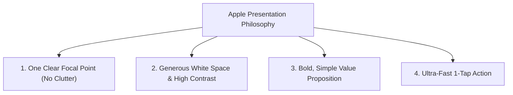
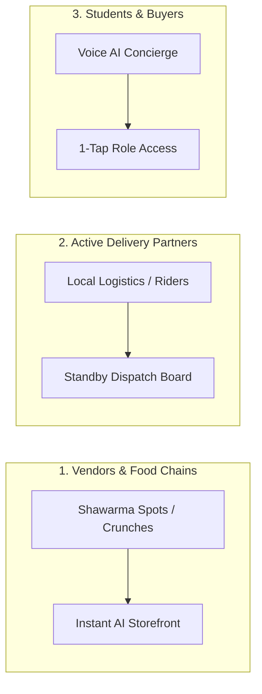

# CampuX — Brand Rebranding & Strategic Onboarding Blueprint

**Scaling Beyond Enugu: Nationwide Brand Strategy, Apple-Style Simplicity & Logistics Integration**

---

## 1. Scalable Brand Naming Strategy (Beyond Enugu)

If the app is named "Enugu Buy & Sell", scaling to Lagos (UNILAG), Ibadan (UI), or Nsukka (UNN) would require building a new app from scratch.

### Recommended National Brand Names:
1.  **CampuX** *(Recommended)* — Short, modern, tech-forward. Means "Campus Exchange & Everything Super App".
2.  **UniDash** — Highlights speed, daily utility, and campus delivery.
3.  **Stash** — Short, catchy, appeals to student earnings and shopping.

### The Multi-Campus Location Architecture:
Instead of separate websites, the app becomes **CampuX**, with a location selector at the top:
*   `CampuX` ➔ Location: **UNEC Enugu**
*   `CampuX` ➔ Location: **UNN Nsukka**
*   `CampuX` ➔ Location: **UNILAG Lagos**

---

## 2. Silicon Valley Presentation Philosophy (Apple & Amazon Simplicity)

The best global companies (Apple, Amazon, Nike) present their products with **extreme simplicity**:

*   **Zero Clutter:** Remove noisy secondary buttons and text walls.
*   **Hero Focus:** Big, bold headline + 1 clear action.

---

## 3. The 3-Tier Onboarding Strategy

To launch seamlessly, we onboarding 3 distinct groups:

### A. Vendor Onboarding (Phase 1)
*   Offer local food spots & student creators a **Free AI-Assisted Digital Shop**.
*   AI creates their menu/catalog in under 60 seconds.

### B. Delivery Partner / Logistics Onboarding
*   Partner with existing local motorcycle/keke logistics riders in Enugu.
*   Riders register on the **Delivery Dispatch Board** to accept order notifications.

### C. Student Onboarding (Voice AI Concierge)
*   Students speak to the AI Concierge to register in 20 seconds hands-free.

---

## 4. Enhanced Conversational Voice AI (Intelligence Layer 2.0)

We upgrade the Voice AI Concierge from simple transcript parsing to **Multi-Turn Conversational Intelligence**:

*   **Conversational Memory:** Remembers past purchases and student preferences.
*   **Proactive Assistance:** *"Welcome back Chidinma! Do you want to re-order shawarma from Crunches or check your shop views?"*
