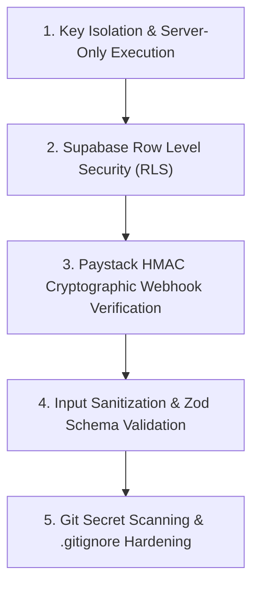
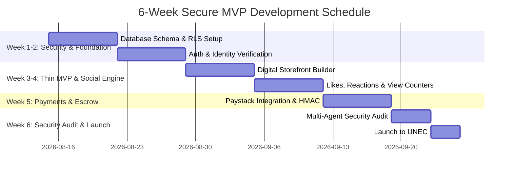

# Enugu Buy & Sell: Security Architecture & Multi-Agent Roadmap

**Target Timeline:** 6-Week MVP Launch  
**Core Directive:** Zero Key Exposure, Bank-Grade Security, and Specialized Multi-Agent Task Delegation.

---

## Part 1: The 5-Layer Security Defense Plan

To ensure no hacker can breach the database, tamper with financial transactions, or leak API keys, we will implement 5 military-grade security layers:

### Layer 1: Zero Key Exposure (Server-Only Isolation)
*   **The Threat:** Exposing database keys or Paystack secret keys in the browser where hackers can inspect them.
*   **The Defense:** 
    *   Secret keys (`SUPABASE_SERVICE_ROLE_KEY`, `PAYSTACK_SECRET_KEY`, `GEMINI_API_KEY`) will **NEVER** be prefixed with `NEXT_PUBLIC_`.
    *   Keys are executed strictly inside Next.js Server Actions and API Routes running on secure cloud servers. The browser client receives only sanitized HTML/JSON.

### Layer 2: Supabase Row Level Security (RLS)
*   **The Threat:** A malicious user modifying database queries in their browser to view other students' private messages or alter shop balances.
*   **The Defense:**
    *   Every table in Supabase will have strict **Row Level Security (RLS)** rules enabled.
    *   Users can only read/write data that belongs explicitly to their authenticated User ID (`auth.uid() = user_id`).
    *   Anonymous users cannot alter data under any circumstances.

### Layer 3: Paystack Webhook Cryptographic Verification (HMAC SHA512)
*   **The Threat:** A hacker sending fake "Payment Successful" HTTP requests to your server to get free items without paying.
*   **The Defense:**
    *   Every payment notification from Paystack must be verified using **HMAC SHA512 signature hashing**.
    *   If the request signature does not match your Paystack secret key hash down to the exact bit, the server rejects it instantly.

### Layer 4: Input Validation & XSS Defense
*   **The Threat:** Hackers injecting malicious JavaScript or SQL into product titles or chat messages.
*   **The Defense:**
    *   All user inputs pass through **Zod Schema Validation** before reaching the database.
    *   Next.js automatically escapes all rendered text, preventing Cross-Site Scripting (XSS).

### Layer 5: Repository Hardening & Secrets Audit
*   **The Threat:** Accidentally pushing `.env.local` or secret keys to GitHub.
*   **The Defense:**
    *   Strict `.gitignore` enforcement.
    *   Pre-commit hooks that scan every line of code for API key patterns before committing.

---

## Part 2: Multi-Agent & Tool Task Assignment (6-Week Sprint)

To hit our 6-week target while maintaining ironclad code quality, we divide responsibilities among specialized agents/tools:

| Agent / Tool | Specialized Role | Primary Responsibilities |
| :--- | :--- | :--- |
| **Antigravity (Lead Orchestrator)** | **Product Lead & Systems Integrator** | System architecture, coordinating subagents, building core Next.js routes, UI/UX implementation. |
| **Codex / Security Auditor Agent** | **Code Auditor & Security Specialist** | Scanning every pull request for vulnerabilities, validating Supabase RLS policies, checking XSS/injection risks. |
| **Cloud / Database Agent** | **Backend & Database Engineer** | Managing Supabase schemas, real-time WebSockets setup, index optimization, and automated backups. |
| **Fintech / Payment Specialist** | **Paystack Escrow Engineer** | Writing Paystack payment hooks, webhook signature verification, and multi-party payment splitting logic. |

---

## Part 3: 6-Week Execution Timeline

