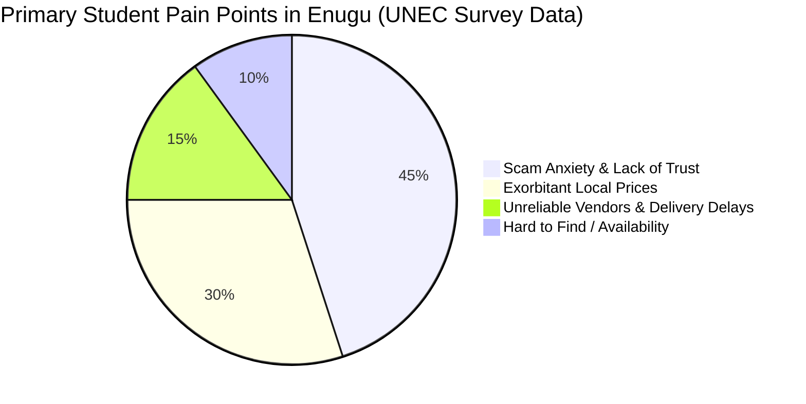
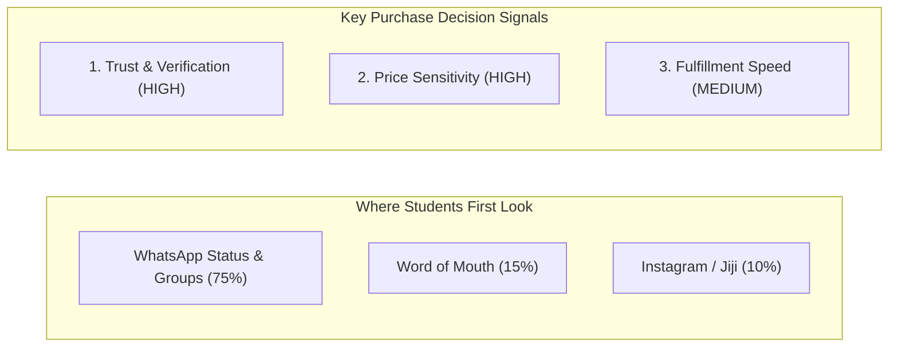

# UNEC Student Marketplace Survey & Market Validation Report

**Empirical Research Compilation — University of Nigeria, Enugu Campus (UNEC)**  
*Document Version: 1.0*  
*Target Audience: Internal Team, Partners, Stakeholders & Investors*

---

## 1. Executive Summary

This report compiles the empirical market research conducted directly with **students and campus vendors at the University of Nigeria, Enugu Campus (UNEC)**. 

The primary objective of the survey was to uncover the core frictions in buying, selling, and discovering products within student communities in Enugu. The research validated a massive market opportunity for a **trusted, student-focused marketplace**, revealing that **45% of students suffer from scam anxiety and lack of trust**, while **30% struggle with exorbitant local price inflation**.

---

## 2. Key Quantitative Survey Findings

### Breakdown of Student Pain Points:
1. **Scam Anxiety & Trust Deficit (45%):**  
   Students express severe fear of sending money online or dealing with unverified sellers on general platforms (WhatsApp groups, generic classifieds).
2. **Exorbitant Local Prices (30%):**  
   Items around student hostels and local shops carry heavy price markups compared to wider state markets.
3. **Vendor Unreliability & Delivery Delays (15%):**  
   Lack of communication, delayed order fulfillments, and unresponsive sellers.
4. **Item Availability & Discovery Friction (10%):**  
   Difficulty locating specific textbooks, fairly used laptops, or quality hostel appliances quickly.

---

## 3. Direct Student Quotes & Market Signals

Below are verbatim quotes recorded from UNEC students during the empirical survey:

> 💬 **On Security & Scams:**  
> *"I wish there were a reliable platform where buyers and sellers could verify each other, make secure payments, and avoid scams."*

> 💬 **On Buyer/Seller Safety:**  
> *"I wish there was a business platform where students could buy and sell safely without being cheated."*

> 💬 **On Vendor Accountability:**  
> *"I wish vendors didn't delay... and improved their attitude towards student buyers."*

> 💬 **On Price Inflation:**  
> *"Prices of goods are quite exorbitant compared to other states... I wish I could purchase goods at a cheaper rate."*

---

## 4. Student Behavioral Insights & Channel Preferences

* **Dominant Channel:** **WhatsApp** is currently where 75%+ of campus commerce attempts occur, but it lacks searchability, seller verification, and product persistence.
* **The Opportunity:** Sellers need a **persistent digital shop link** that they can easily share to WhatsApp, giving buyers a structured, searchable, and verified store experience.

---

## 5. Key Strategic Product Recommendations

Based on the survey data, the platform architecture incorporates four non-negotiable solutions:

1. **The Shop as the Atomic Unit:**  
   Instead of temporary, disposable listings, sellers own a **persistent digital shop** (`Identity → Shop → Products → Buyers → Reputation`).
2. **Built-in Trust & Verification Signals:**  
   Clear seller verification badges and account age transparency to eliminate scam anxiety.
3. **Contextual Product Chat:**  
   Direct buyer-to-seller chat linked directly to the item being inquired about (`"Conversation regarding: HP EliteBook 840 G5 — ₦280,000"`).
4. **Simple 1-Tap Entry Doors:**  
   The homepage immediately presents two simple actions: **`FIND SOMETHING`** and **`START YOUR SHOP`**.

---

*Report Compiled for Enugu Buy & Sell (Kinsok Enterprises)*
