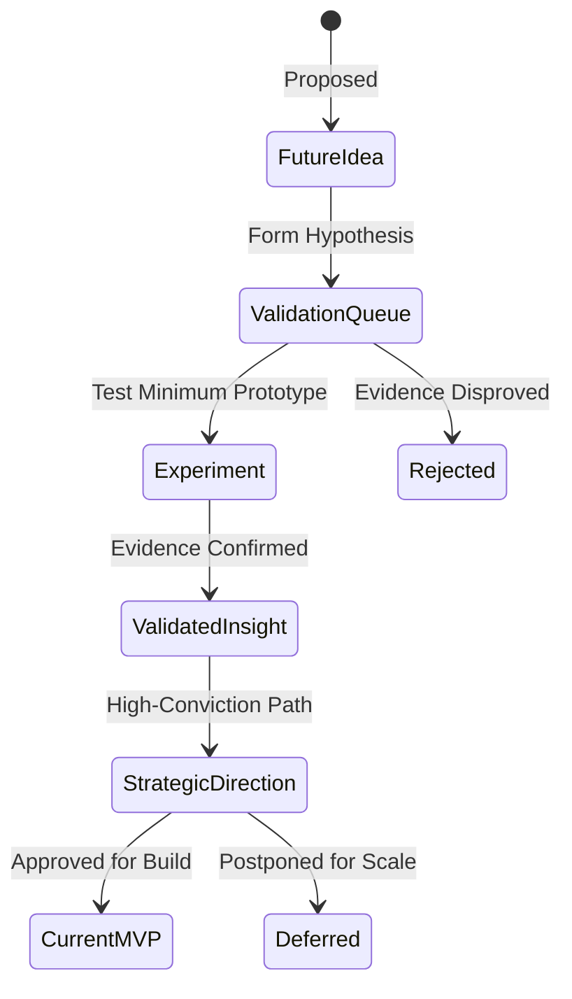
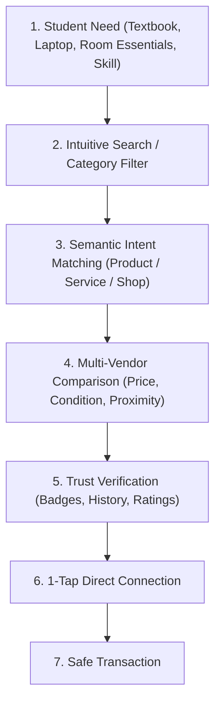
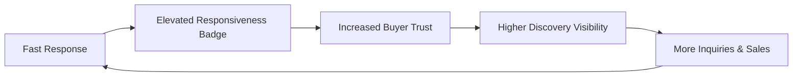
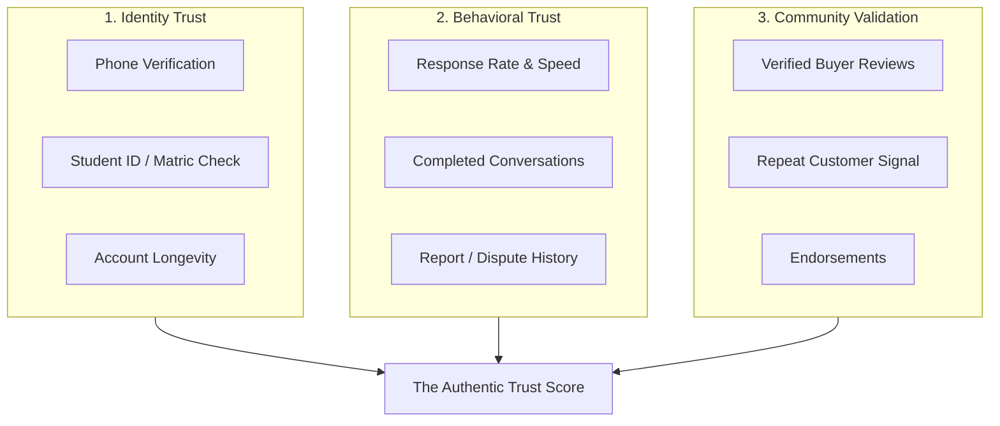
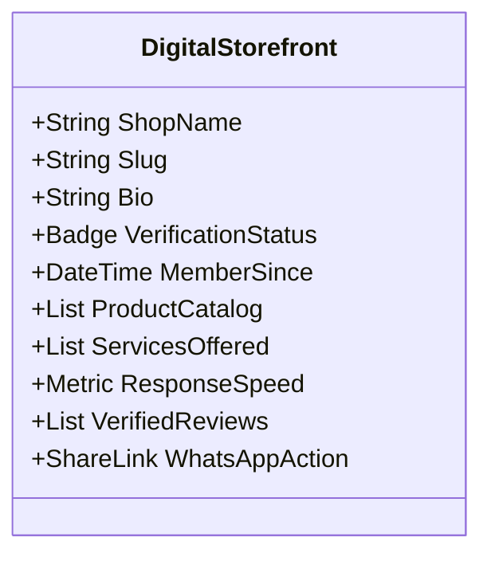
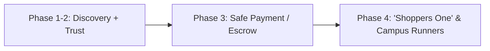
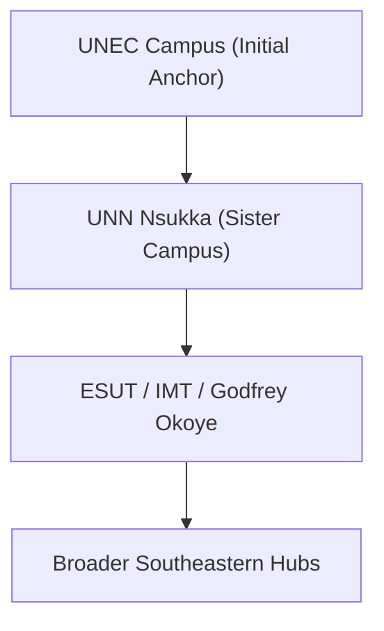
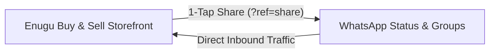
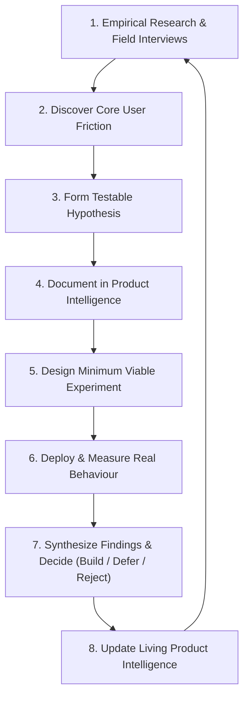
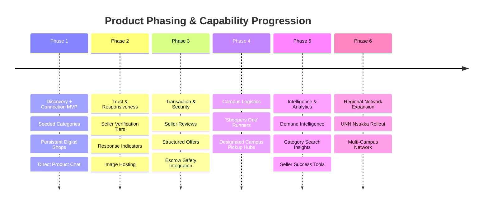

# KINGSOK MARKETPLACE — PRODUCT INTELLIGENCE & FUTURE DIRECTIONS

### ENUGU BUY & SELL — Powered by KINGSOK

**Document Version:** 1.0.0  
**Last Updated:** 2026-08-21  
**Current Product Phase:** Phase 1 (Discovery + Connection MVP Baseline)  
**Document Owner:** Lead Product/Engineering Coordinator & KINGSOK Founder  
**Status:** Living Document  

---

## 1. Product North Star

The fundamental philosophy of the **ENUGU BUY & SELL** marketplace is to guide a student frictionlessly through:

$$\text{DISCOVER} \longrightarrow \text{EVALUATE} \longrightarrow \text{TRUST} \longrightarrow \text{CONNECT} \longrightarrow \text{EVENTUALLY TRANSACT}$$

### Core Questions the Product Must Answer Instantly
1. *"I need something."*
2. *"What exactly am I looking for?"*
3. *"Who sells it on or around campus?"*
4. *"Can I trust this seller?"*
5. *"Can I contact them quickly and directly?"*

### Strategic Imperative
* **The Immediate Priority is NOT Logistics.** 
* **The Immediate Priority is making DISCOVERY + TRUST + CONNECTION exceptionally strong, simple, and lightning-fast.**
* The platform starts as a focused campus commerce hub and eventually evolves into a comprehensive **Discovery Engine** for student life and local services.

---

## 2. Current MVP Scope (Phase 1 Baseline)

### The Core Capabilities
* **Product Discovery & Exploration:** Fast browsing with instant category navigation.
* **Search:** Simple, responsive search across active listings.
* **Category Discovery:** 9 seeded categories structured around student demand.
* **Seller / Digital Storefronts:** The **Shop** is the persistent atomic unit (`Identity → Shop → Products → Buyers → Reputation`).
* **Product Detail Pages:** Clean pricing, product specs, seller trust signals, and direct contact CTAs.
* **Buyer/Seller Connection & Contextual Messaging:** Direct inquiry loops linked directly to specific products (`app/api/conversations`).
* **Telemetry & Analytics:** Hardened event tracking (`lib/telemetry.ts`, `analytics_events`) capturing organic referral and share loops (`?ref=share`).
* **Basic Safety & Reporting:** Server-validated reporting endpoints (`reports` table) to flag suspicious activity.
* **Mobile-First Experience:** Built specifically for fast mobile viewport usage where 80%+ of student interactions occur.

### Current MVP Philosophy
$$\text{START WITH DISCOVERY AND CONNECTION.}$$
Do not overload the early product with complex infrastructure before the fundamental commerce loop is validated by real users.

---

## 3. Currently Deferred (Not Rejected)

The following capabilities are **deliberately deferred** from the initial release to protect product focus and development velocity:

* **Full Delivery Infrastructure:** Courier management, GPS delivery tracking, automated rider dispatch.
* **Complex Payment & Escrow Infrastructure:** Embedded automated checkout gateways prior to high organic liquidity.
* **Advanced AI & Recommendation Engines:** Complex algorithmic feeds or automated pricing AI.
* **Excessive Marketplace Automation:** Over-engineered seller dashboards or complex enterprise inventory tools.
* **Features Without Validated Demand:** Any tooling not directly tied to resolving discovery, trust, or communication bottlenecks.

> [!IMPORTANT]
> **DEFERRED $\neq$ REJECTED.**  
> A deferred feature becomes an active priority when empirical marketplace data and scale justify its implementation.

---

## 4. Product Intelligence Model

To prevent subjective decision-making, every concept in this document is classified under one of six explicit categories:

1. **`[VALIDATED INSIGHT]`**: Backed by empirical survey evidence, real student interviews, or measurable production metrics.
2. **`[STRATEGIC DIRECTION]`**: An architectural path established from synthesized validated insights.
3. **`[FUTURE IDEA]`**: A promising possibility that has not yet been sufficiently tested.
4. **`[EXPERIMENT]`**: A targeted, low-cost test designed to generate empirical evidence.
5. **`[DEFERRED]`**: Valuable and recognized, but intentionally scheduled for later phases.
6. **`[REJECTED]`**: Explicitly evaluated and ruled out due to friction, misalignment, or negative evidence.

---

## 5. Research & Customer Learning (UNEC Empirical Evidence)

### Entry R-001: The Scam Anxiety & Trust Deficit
* **DATE:** 2026-08
* **SOURCE:** UNEC Empirical Student Survey (20 respondents)
* **USER TYPE:** Student Buyer
* **INSIGHT:** **45% of students identify scam anxiety and lack of trust as their #1 commerce obstacle.**
* **EVIDENCE:** Direct quotes: *"I wish there were a reliable platform where buyers and sellers could verify each other, make secure payments, and avoid scams."* / *"I wish there was a business platform where students could buy and sell safely without being cheated."*
* **PRODUCT IMPLICATION:** Trust signals (account age, verification status, product ownership verification) must be visible on every touchpoint before purchase intent occurs.
* **STATUS:** `VALIDATED INSIGHT`

### Entry R-002: Exorbitant Local Campus Inflation
* **DATE:** 2026-08
* **SOURCE:** UNEC Empirical Student Survey
* **USER TYPE:** Student Buyer
* **INSIGHT:** **30% of students struggle with exorbitant price markups at hostel-adjacent stalls.**
* **EVIDENCE:** Direct quote: *"Prices of goods are quite exorbitant compared to other states... I wish I could purchase goods at a cheaper rate."*
* **PRODUCT IMPLICATION:** Price transparency and cross-campus vendor discovery empower buyers to compare rates and find competitive prices easily.
* **STATUS:** `VALIDATED INSIGHT`

### Entry R-003: Vendor Unreliability & Response Delays
* **DATE:** 2026-08
* **SOURCE:** UNEC Empirical Student Survey & Vendor Interviews
* **USER TYPE:** Student Buyer & Student Seller
* **INSIGHT:** **15% of frictions stem from unresponsive sellers, communication breakdown, and delivery delays.**
* **EVIDENCE:** Direct quote: *"I wish vendors didn't delay... and improved their attitude towards student buyers."*
* **PRODUCT IMPLICATION:** Seller responsiveness indicators (e.g. response time, active status) are required to set accurate buyer expectations.
* **STATUS:** `VALIDATED INSIGHT`

### Entry R-004: Dominance of WhatsApp & Lack of Persistence
* **DATE:** 2026-08
* **SOURCE:** UNEC Campus Commerce Observation
* **USER TYPE:** Campus Merchant / Micro-Seller
* **INSIGHT:** 75%+ of campus commerce attempts occur on WhatsApp status updates and groups, but listings disappear after 24 hours and lack searchability.
* **EVIDENCE:** Sellers continuously re-post flyers daily; buyers cannot search past catalogs or verify seller track records.
* **PRODUCT IMPLICATION:** Give sellers a **persistent, shareable digital shop link** (`/shops/[slug]`) optimized for 1-tap WhatsApp sharing (`?ref=share`).
* **STATUS:** `VALIDATED INSIGHT`

---

## 6. The Discovery Engine Architecture

The long-term vision is an intelligent discovery engine tailored specifically for student ecosystems:

### Potential Long-Term Discovery Capabilities
* **Intent-Aware Natural Language Search:** Handling unstructured campus phrasing (e.g. *"cheap fairly used double bunk hostel mattress"*).
* **Cross-Vertical Filtering:** Location-based filtering (Hostel vs. Off-Campus Gate), price boundaries, and item condition (Brand New vs. Fairly Used).
* **Demand-Driven Matchmaking:** Surfacing available inventory based on peak academic cycles (exam revisions, clearance sales, freshman resumption).

---

## 7. Seller Responsiveness System

### The Problem
When a buyer inquires about a product and receives no answer, confidence collapses, and the marketplace feels inactive.

### The Strategy: Make Responsiveness Measurable & Rewarding
Instead of forcing vendors to stay active 24/7, the platform should **make responsiveness transparent** and **reward active communication**:

### Future Direction Concepts
* **Transparent Activity Indicators:** `Active Today`, `Usually responds in under 1 hour`.
* **Behavioral Merit Badges:** `Fast Responder`, `Active Store`.
* **Seller Notification Channels:** Multi-channel alerts (WhatsApp alert webhooks, SMS ping for high-priority inquiries, push notifications).
* **Automated Seller Tools:** Custom away messages, saved quick replies, and estimated response windows.

---

## 8. The Trust Graph

> [!CAUTION]
> **CRITICAL RULE: NEVER FABRICATE TRUST.**  
> Never fabricate fake reviews, artificial star ratings, inflated view counts, or false verification badges. Every trust signal must represent authentic marketplace activity.

**Guiding Principle:** Trust must answer *"Why should I trust this seller right now?"* rather than presenting a generic 5-star abstraction.

---

## 9. Seller Success System

**Strategic Principle:** *If sellers make more sales with less friction, marketplace liquidity and retention grow automatically.*

### Potential Future Capabilities
* **Storefront Performance Analytics:** Listing views, WhatsApp share conversions, search impressions.
* **Inventory Optimization Guidance:** Surfacing fast-moving campus price points and high-demand product categories.
* **Storefront Marketing Tooling:** Automated promotional flyer generation and structured catalog exports.

---

## 10. Digital Storefront Evolution

The storefront (`/shops/[slug]`) must function as a comprehensive **Digital Store** rather than a passive profile page:

* **Visual Identity:** Distinct branding, verified badge, cover banner, and structured business info.
* **Persistent Catalog:** Dynamic stock filtering (In Stock, Reserved, Sold Out).
* **Reputation History:** Cumulative confirmed trades, reviews, and badges.

---

## 11. Delivery & Logistics

### Strategic Positioning: `STATUS: DEFERRED`
Delivery is a real friction point for busy students, but **building delivery infrastructure prematurely would distract from establishing core discovery and trust.**

### Future Logistics Possibilities
* **Campus Runner Network ("Shoppers One"):** Peer student runners facilitating market errands and deliveries between hostel gates.
* **Designated Campus Meeting Points:** Safe, well-lit campus landmarks (e.g. UNEC Library Gate, SUB, Main Gate) suggested for item inspections.
* **Courier Integration:** Partnering with existing local dispatch operators once order density justifies it.

---

## 12. Campus Network Effect & Density Strategy

### Hyperlocal Density First
$$\text{BUILD DENSITY BEFORE GEOGRAPHIC EXPANSION.}$$

* Expanding to new locations prematurely dilutes liquidity. 
* A complete, thriving marketplace on **one single campus** is infinitely more valuable than a fragmented presence across ten campuses.

---

## 13. Seller Verification Architecture

Verification badges must have explicit meaning:

| Tier | Badge | Verification Requirement | Meaning to Buyer |
|:---|:---|:---|:---|
| **Tier 1** | `Phone Verified` | SMS OTP / Verified Contact | Direct contact channel confirmed |
| **Tier 2** | `Verified Student` | Active Student ID / Portal Verification | Real, identifiable campus community member |
| **Tier 3** | `Verified Merchant` | Physical Store Location / Business Registration | Established local vendor with physical presence |

---

## 14. Conversation Intelligence

**Strategic Principle:** *AI should assist human commerce, never simulate artificial conversations.*

* **Structured Inquiry Templates:** Pre-filled inquiries (*"Is this available?", "Can we meet at the campus gate?"*).
* **Contextual Banners:** Direct link to the product price and details anchored inside the chat room.
* **Seller Productivity Tools:** Instant reply snippets for common inquiries (operating hours, payment terms, meeting points).

---

## 15. The WhatsApp Commerce Bridge

Students and campus merchants live on WhatsApp. The marketplace must bridge this behavior rather than fight it:

* **Seamless Link Generation:** Instant pre-formatted copy for WhatsApp status broadcasting.
* **Persistent Catalog:** Turning a temporary 24-hour status post into a permanent, searchable web inventory.

---

## 16. Marketplace Data Intelligence

As transaction and search density grow, aggregated analytics provide critical market insights:
* **Unmet Campus Demand:** High-frequency search queries with zero matching inventory.
* **Price Distribution Bands:** Real-time pricing trends for student essentials (e.g. laptops, smartphones, cookware).
* **Seasonal Surges:** Predictable resupply spikes (Freshman orientation, exam prep, semester clearance).

---

## 17. Services Marketplace Expansion

**Strategic Principle:** *Connect students to both goods and campus skill providers.*

### High-Opportunity Campus Services
* **Beauty & Grooming:** Hair styling, barbering, nail care.
* **Tech & Hardware Services:** Phone repairs, laptop formatting, software installation.
* **Academic & Creative:** Graphic design, photography, tutoring, typing/printing support.
* **Artisans:** Tailoring, laundry services, event catering.

---

## 18. Marketplace Safety & Trust Framework

$$\text{NEVER SACRIFICE SAFETY FOR TRANSACTION SPEED.}$$

* **Transparent Reporting Mechanism:** Fast reporting for counterfeit items, scam attempts, or harassment.
* **Automated Moderation Boundaries:** Keyword alerts and fraud pattern scanning on new listings.
* **Safety Guidelines:** In-app safety reminders encouraging campus daylight meetups in public areas.

---

## 19. Permanent Product Design Principles

1. **Discovery should be fast:** Minimal barriers between landing and finding products.
2. **Guest browsing is foundational:** Users should never be forced to sign up just to explore.
3. **Trust must be visible:** Seller credentials, badges, and history should be clear at a glance.
4. **Reliability must be rewarded:** Responsive and honest sellers earn higher visibility.
5. **Mobile comes first:** Every screen must be designed for mobile thumb reach and small screens.
6. **Motion should clarify, not decorate:** Animations should indicate state transitions, never waste user time.
7. **Search should be simple and forgiving:** Handles typo tolerance and natural search terminology.
8. **Categories guide discovery:** Categories organize browsing without competing with direct search.
9. **The marketplace must feel active:** Fresh listings, responsive sellers, and dynamic community signals.
10. **Build complexity only when demand forces it:** Never build speculative infrastructure before validation.
11. **Density over broad expansion:** Win one campus completely before launching the next.
12. **Never fabricate trust:** No synthetic reviews, artificial stars, or fake view metrics.
13. **Every feature must serve a core pillar:** Strengthen Discovery, Trust, Connection, or Transaction.
14. **Avoid building from excitement:** Measure every idea against empirical user problems.
15. **Separate evidence from assumptions:** Clearly label validated data versus untested hypotheses.
16. **Test with minimum prototypes:** Run lightweight experiments before committing architectural resources.
17. **Solve the main bottleneck first:** Optimize the primary user friction point before adding new features.
18. **Preserve simplicity as capability grows:** Add functionality without cluttering the user interface.

---

## 20. Product Decision Log

| Date | Decision | Rationale | Status |
|:---|:---|:---|:---|
| **2026-08-13** | The Shop is the atomic unit of the marketplace | Individual listings lack accountability; persistent storefronts build seller brand and reputation. | `ACTIVE` |
| **2026-08-14** | Unauthenticated guest browsing enabled | Forcing login on home/browse creates 60%+ dropoff; authentication occurs when user acts (creates shop/messages). | `ACTIVE` |
| **2026-08-17** | Remove external AI dependencies from runtime paths | Prevent latency and failure points in core database endpoints; focus on high-speed structured queries. | `ACTIVE` |
| **2026-08-18** | Write-only public telemetry architecture (`analytics_events`) | Protect analytics collection with RLS while preventing public scraping or leakage of user event streams. | `ACTIVE` |
| **2026-08-19** | Deferred full delivery and escrow systems | Establishing discovery, trust, and connection liquidity must precede complex physical logistics. | `DEFERRED` |
| **2026-08-20** | WhatsApp bridge as primary distribution vector | Capitalize on existing student habit of posting to WhatsApp status rather than attempting to replace it. | `ACTIVE` |

---

## 21. Idea Inbox

### IDEA-001: Automated WhatsApp Status Poster / Flyer Generator
* **Problem:** Sellers spend significant time manually typing product details onto image flyers for WhatsApp status updates.
* **Potential Solution:** A 1-tap button generating a downloadable image card featuring product photo, price, shop name, and QR code.
* **Why It Matters:** Accelerates organic viral sharing and standardizes listing presentation across campus.
* **Priority:** Medium
* **Status:** `FUTURE IDEA`
* **Dependencies:** Image storage infrastructure.
* **Questions to Validate:** Do sellers prefer image downloads or pre-written text captions with links?

### IDEA-002: Campus Landmark Meeting Point Selector
* **Problem:** Buyers and sellers waste time negotiating where to meet safely on campus.
* **Potential Solution:** A quick dropdown in chat offering verified meeting spots (e.g. UNEC Library, Franco Refectory Gate).
* **Why It Matters:** Reduces scam anxiety and speeds up transaction completion.
* **Priority:** Medium
* **Status:** `FUTURE IDEA`
* **Dependencies:** Chat system maturity.
* **Questions to Validate:** What are the top 5 recognized safe landmarks across UNEC?

---

## 22. Validation Queue

### Experiment VQ-001: Seller Responsiveness Signal Impact
* **What we believe:** Displaying *"Usually responds in under 1 hr"* will increase buyer message conversion by 25%+.
* **What we need to learn:** Does the badge motivate sellers to reply faster, or does it discourage buyers from messaging slower sellers?
* **Who should we ask:** Active student buyers and sellers during early testing.
* **What evidence would validate it:** Higher message initiation and faster median seller response times.
* **What evidence would reject it:** Buyers abandoning listings with *"Usually responds in 4+ hrs"* with no improvement in seller reply speed.
* **Next experiment:** A/B test static response badges on select product pages during Phase 2.

### Experiment VQ-002: Verified Student ID Badge Conversion
* **What we believe:** The `Verified Student` badge reduces buyer scam anxiety and increases inquiry volume.
* **What we need to learn:** What friction level students will tolerate to complete student verification (e.g. uploading student ID card vs. institutional email).
* **Who should we ask:** UNEC student sellers.
* **What evidence would validate it:** 70%+ of active sellers willingly verify their student identity.
* **What evidence would reject it:** High drop-off during ID upload due to privacy concerns.
* **Next experiment:** Lightweight manual verification badge test with the first 25 campus sellers.

---

## 23. The Continuous Product Learning Loop

---

## 24. Future Product Evolution Phases

---

## 25. Research Evidence Integrity Rule

When recording new entries into this strategic memory:
1. **Never invent quotes or fabricate user metrics.**
2. **Always separate actual observed behavior from hypothetical assumptions.**
3. **Explicitly tag every finding with its verification level:** `[OBSERVED]`, `[INFERRED]`, `[PROPOSED]`, or `[VALIDATED]`.

---

## 26. Change History

| Version | Date | Author / Role | Summary of Changes | Reason |
|:---|:---|:---|:---|:---|
| **1.0.0** | 2026-08-21 | Lead Product/Engineering Coordinator | Initial creation of the living Product Intelligence & Strategic Directions system | Consolidating research insights, architectural principles, and future roadmap memory |

---

## 27. Document Maintenance Governance

* **When to Update:** Following major empirical research sessions, founder strategy decisions, architectural milestones, or validated experiment results.
* **What NOT to Include:** Fleeting conversational ideas, minor UI tweaks, or unvetted suggestions that do not affect the fundamental commerce engine.

---

## 28. Open Product Questions (Current Strategic Focus)

1. **Buyer Trust Threshold:** What specific combination of signals (student badge, phone verification, seller age) triggers the leap from browsing to messaging?
2. **Seller Response Incentives:** What lightweight incentive (search ranking, badges, sales volume) most effectively drives under-15-minute response times?
3. **Product Image Storage:** When should cloud image storage (e.g. Supabase Storage) be introduced to transition from URL-based listings to native mobile uploads?
4. **Service Listings Architecture:** How should service providers (hairdressers, graphic designers, tech repairers) display portfolios versus physical product inventories?
5. **Campus Density Threshold:** What specific active listing count and daily conversation volume defines market readiness before expanding from UNEC to UNN Nsukka?
